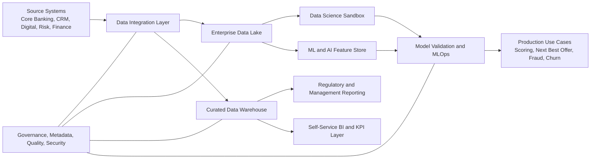
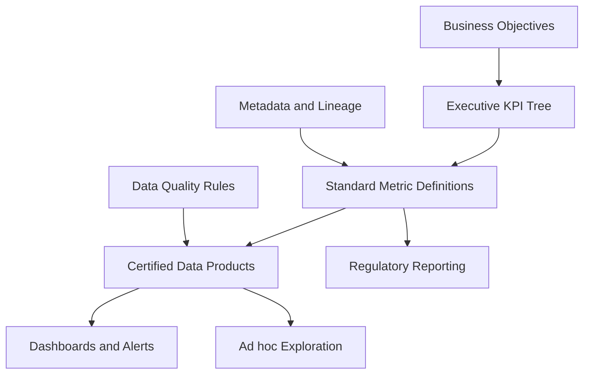
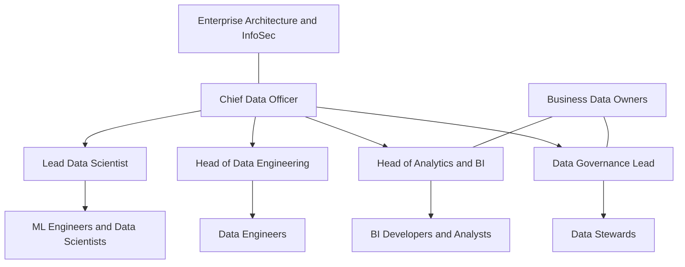

## The Mandate

::: {.grid-2}
::: {.card}
Context

# Turn data into a controlled, trusted, monetizable bank asset

Ardshinbank is hiring a CDO to build **one integrated data function** across:

- **Data Governance**
- **Analytics and BI**
- **Data Science and AI**
- **Enterprise data platform**: DWH + Data Lake
:::

::: {.card}

My vision is not to build another reporting team. It is to create a bank-wide data operating system that improves decisions, strengthens control, and accelerates digital growth.

Based on Ardshinbank CDO job description

:::
:::

## Why This Role Matters Now

::: {.grid-3}
::: {.card}

<i class="fa-solid fa-shield-halved"></i>

### Regulatory confidence
Data ownership, lineage, quality, and access controls must be explicit and auditable.
:::

::: {.card}

<i class="fa-solid fa-building-columns"></i>

### Banking complexity
Core banking, digital channels, risk, finance, and CRM need one common information backbone.
:::

::: {.card}

<i class="fa-solid fa-bolt"></i>

### AI readiness
AI without governed, reusable, high-quality data creates risk faster than value.
:::
:::

## My North Star

::: {.grid-3}
::: {.card}

1

### Trusted data
A governed source of truth for customers, products, transactions, and risk.
:::

::: {.card}

2

### Faster decisions
Self-service analytics for executives and business units with stable KPI definitions.
:::

::: {.card}

3

### Scalable innovation
A production-grade path from BI to advanced analytics to AI deployment.
:::
:::

## What I Would Build

## Operating Model

::: {.grid-2}
::: {.card .tight}
### Central data office

- Enterprise architecture for data
- Governance, standards, controls
- Shared data engineering platform
- Common semantic layer and KPI catalog
- Data science governance and MLOps
:::

::: {.card .tight}
### Federated business ownership

- Business data owners by domain
- Embedded analysts close to decisions
- Prioritization with business and IT
- Shared accountability for quality and adoption
- Clear stewardship model
:::
:::

## Governance First, Not Governance Heavy

::: {.grid-3}
::: {.card}
### Ownership
Assign accountable data owners and stewards for critical domains.
:::

::: {.card}
### Quality
Define controls, thresholds, issue workflows, and remediation cycles.
:::

::: {.card}
### Access
Implement role-based access, confidentiality rules, and traceability.
:::
:::

::: {.card}
### Governance principle
**Minimum viable control, maximum practical adoption.**

Policies only matter when they are embedded in platforms, workflows, and delivery teams.
:::

## KPI Architecture

## First 90 Days

::: {.grid-3}
::: {.card}

0-30 days

### Assess
Map systems, stakeholders, data pain points, and critical reporting flows.
:::

::: {.card}

31-60 days

### Stabilize
Launch governance council, define target architecture, identify priority use cases.
:::

::: {.card}

61-90 days

### Deliver
Start lighthouse initiatives with measurable business outcomes and visible executive sponsorship.
:::
:::

## Priority Deliverables In Year 1

::: {.grid-2}
::: {.card .tight}
### Foundation

- Enterprise data model for critical banking domains
- Data catalog, glossary, and ownership matrix
- DWH and lake architecture roadmap
- Initial quality scorecards for top-priority datasets
- Access control model aligned with security and compliance
:::

::: {.card .tight}
### Business value

- Executive KPI layer with certified definitions
- Standard reporting packs for management and regulators
- Customer 360 and segmentation foundation
- First ML use cases with controlled deployment
- Adoption model for self-service analytics
:::
:::

## Use Cases I Would Prioritize

::: {.grid-2}
::: {.card .tight}
### Value creation

- Next best product offer
- Customer churn prediction
- Branch and channel performance optimization
- Marketing attribution and segment profitability
:::

::: {.card .tight}
### Risk and control

- Fraud detection enhancement
- Early warning indicators
- Credit analytics acceleration
- Data quality monitoring for regulatory submissions
:::
:::

## Team Design

## How I Would Lead

::: {.grid-3}
::: {.card}
### Business-first
Start from decisions, controls, and measurable outcomes rather than tools.
:::

::: {.card}
### Platform mindset
Build reusable data products and shared services, not one-off requests.
:::

::: {.card}
### Execution discipline
Set roadmaps, operating cadences, ownership, and delivery metrics.
:::
:::

## Success Metrics

::: {.grid-3}
::: {.card}
### Trust
Improvement in critical data quality scores and fewer reporting disputes.
:::

::: {.card}
### Speed
Shorter turnaround from data request to management insight.
:::

::: {.card}
### Impact
Use cases moved into production and linked to commercial or risk outcomes.
:::
:::

## Closing

::: {.grid-2}
::: {.card}
### My proposition for Ardshinbank

- Establish a credible, modern data function
- Balance governance with delivery speed
- Build a scalable platform for BI, analytics, and AI
- Make data a competitive capability, not just an IT service
:::

::: {.card}

If selected, I would focus on one outcome above all: a data function the bank can trust, use, and scale.

Karen Hovhannisyan

:::
:::
